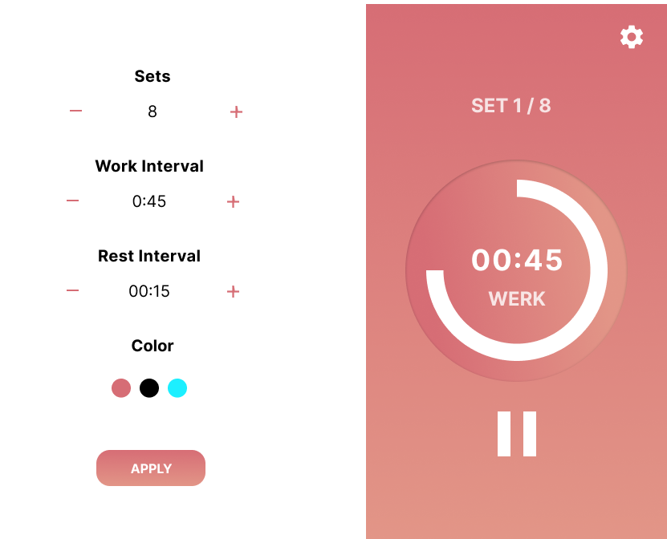
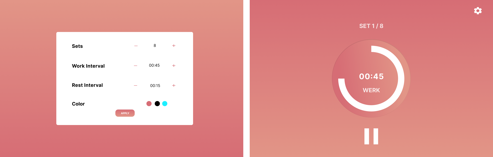

# HIIT Timer

An Interval Time built with React, Styled Components & Redux Toolkit. Prototyped designed with Figma, drawing inspiration from Frontend Mentor & Dribbble designs.

## Overview

This is my attempt to build a timer similar to the one used by FitnessBlender. I used a lot of their videos during - and since lockdown - and this will allow me to start building my own. I'm also planning to use it to learn Redux and React testing. This is also my attempt using Stlyed Components and I'm hoping to up the reusability.

## Figma Design

